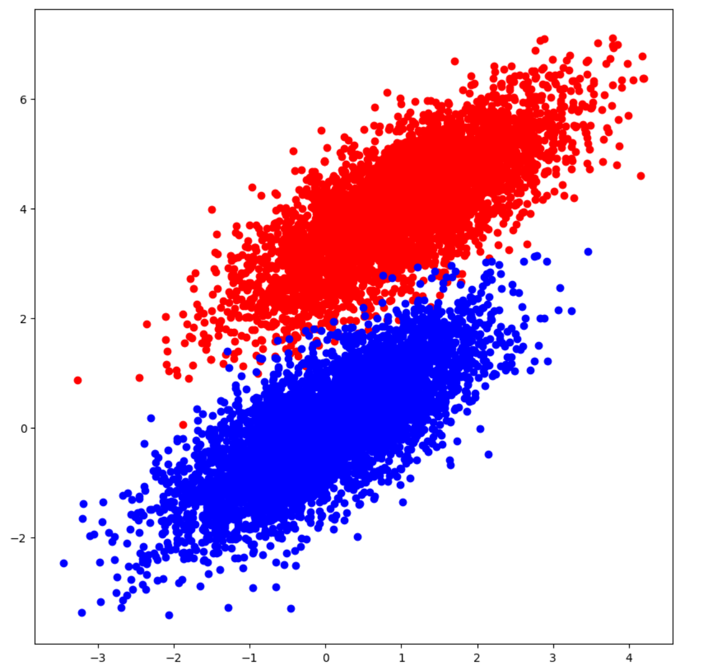
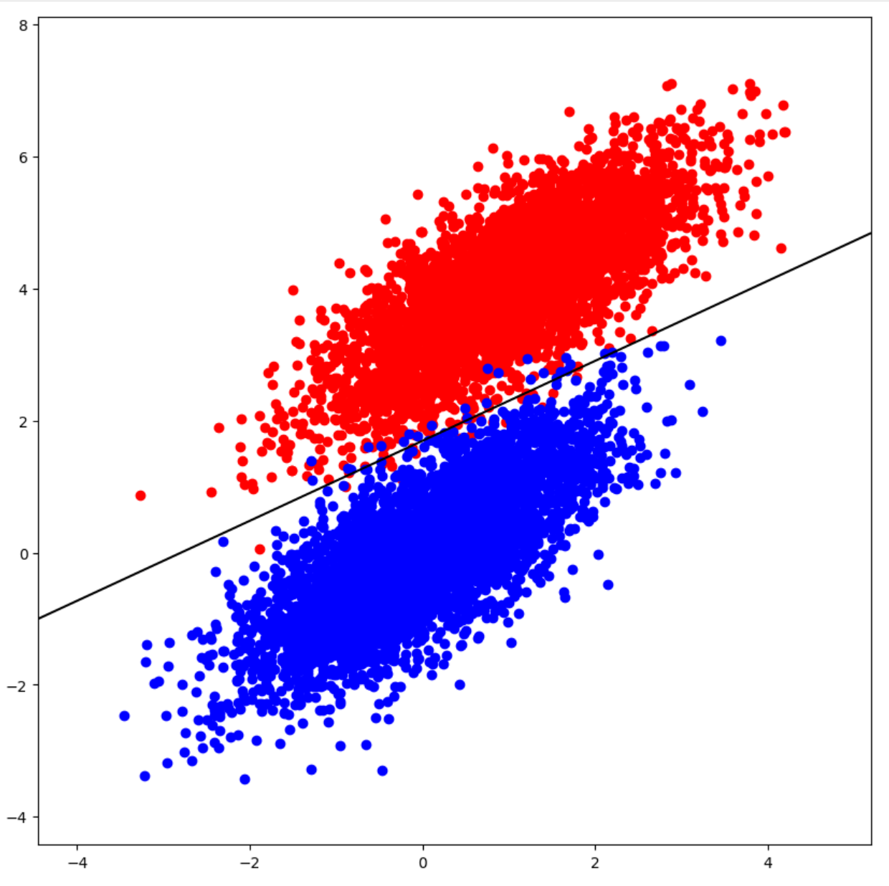

## Logistic Regression From Scratch

logistic_regression_from_scratch.ipynb holds logistic regression implementation and application on the following data. Notebook also contains helpful visualization of the training process as well as the plot for decision boundary on train and test data set. The notebook follows best practices in Machine Learning in training and evaluation

### Data Distribution



### Decision Boundary



### Runtime

```
python3 -m venv logistic-regression
source venv/bin/activate
pip install -r requirements.txt
python -m ipykernel install --name=logistic-regression
jupyter-lab
```

Now attach logistic-regression kernel to your notebook and start executing the cells!
